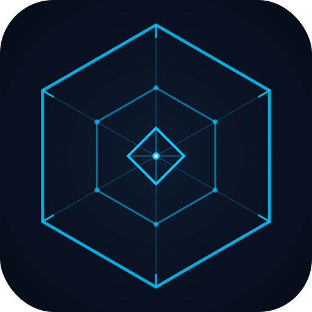

<div align="center">



# STFC Calc

**Star Trek Fleet Command — Armada Calculator**

A native desktop app that estimates which armada strength your fleet can defeat.  
Built with **Tauri · React · TypeScript** — runs natively on macOS and Windows.

[](../../releases/latest)
[](../../releases/latest)
[](LICENSE)

</div>

---

## Why this exists

STFC has no official in-game armada calculator. Each armada faction has different mechanics — escalating crits, mitigation formulas, 3-ship solo setups — and battle outcomes depend heavily on crew, research, and ship type. This tool consolidates all of that into one place.

---

## Features

|                             |                                                                   |
| --------------------------- | ----------------------------------------------------------------- |
| **7 Faction Tabs**          | Federation, Klingon, Romulan, Cardassian, Borg, Dominion, Eclipse |
| **Combat Triangle**         | Ship type advantage / disadvantage (×0.75 – ×1.3)                 |
| **Faction-specific models** | Each armada type uses its own calculation logic                   |
| **Live calculation**        | Result updates as you type                                        |
| **Save & export**           | Save calculations to history, export as CSV                       |
| **Dark / Light mode**       | Persistent theme preference                                       |
| **DE / EN**                 | Full German and English localisation                              |
| **Native app**              | Tauri — no Electron, no browser required                          |

---

## Calculation Models

### Federation · Klingon · Romulan

Standard faction armadas — each counts as a specific ship type.  
Bringing the right counter ship significantly changes the result.

```
Max Armada = Power × Difficulty × Crew × Research × Ship Type
```

| Faction    | Armada type | Counter ship | Advantage |
| ---------- | ----------- | ------------ | --------- |
| Federation | Explorer    | Battleship   | × 1.3     |
| Klingon    | Interceptor | Explorer     | × 1.3     |
| Romulan    | Battleship  | Interceptor  | × 1.3     |

Wrong ship type: **× 0.75** · Neutral: **× 1.0**

---

### Cardassian

Escalating critical hit system — mechanics differ by difficulty.

| Difficulty | Crit Chance      | Crit Damage | Notes                                       |
| ---------- | ---------------- | ----------- | ------------------------------------------- |
| Uncommon   | 20% → +10%/round | —           | After round 8: 100% crit, then **0 damage** |
| Rare       | 20% (fixed)      | 375%        | Gaila reduces by −50% (−110% with synergy)  |
| Epic       | 20% (fixed)      | 450%        | Gaila reduction mandatory                   |

---

### Borg

High-mitigation targets. Borg crew synergy is essential for MegaCubes.

| Target   | Notes                                                           |
| -------- | --------------------------------------------------------------- |
| Sphere   | Manageable with good crew and mitigation                        |
| Cube     | Requires coordination — best crew on the lead ship              |
| MegaCube | Full Borg synergy (Nine/Seven/Five of Eleven) → enemy crits = 0 |

---

### Dominion Solo

You fight alone with **3 of your own ships**, each with its own crew.  
The Defiant provides an Edict Reward bonus (+15%). Launch timer: **1:30 min**.

```
Max Armada = (Ship 1 + Ship 2 + Ship 3) × Difficulty × Research × Defiant
```

---

### Eclipse

Long fights — shield regeneration determines survival duration.

| Spock Setup | Shield regen per round | Survivability   |
| ----------- | ---------------------- | --------------- |
| No Spock    | —                      | Very low (×0.8) |
| Tier 3      | 100% of crew defense   | Low             |
| Tier 4      | 400% of crew defense   | Medium          |
| Tier 5      | 750% of crew defense   | High            |

Hull Breach (Stella crew) adds **+50% crit damage after all other bonuses**.

---

## Common Factors

These apply across all faction calculators:

| Factor     | Uncommon | Rare  | Epic  |
| ---------- | -------- | ----- | ----- |
| Difficulty | × 3.0    | × 1.8 | × 1.1 |

| Crew       | Optimal | Standard | Weak  |
| ---------- | ------- | -------- | ----- |
| Multiplier | × 1.2   | × 1.0    | × 0.8 |

| Research   | High  | Base  |
| ---------- | ----- | ----- |
| Multiplier | × 1.1 | × 1.0 |

> All values are community estimates based on observed results. Actual outcomes depend on many in-game variables. No guarantee of success.

**Sources:** [1](https://stfc.johnwsiskar.com/federation-romulan-klingon-armadas/) [2](https://reds0004.github.io/stfc_armada_guide/armada_pages/cardassian.html) [3](https://stfc.johnwsiskar.com/borg-armadas/) [4](https://stfc.johnwsiskar.com/solo-armadas/) [5](https://reds0004.github.io/stfc_armada_guide/armada_pages/eclipse.html)

---

## Installation

### macOS

1. Go to [**Releases**](../../releases/latest) and download the `.dmg` file
2. Open it and drag **STFC Calc** to your Applications folder
3. Right-click → **Open** on first launch

**"App is damaged" error?** Run this in Terminal, then try again:

```bash
xattr -cr "/Applications/STFC Calc.app"
```

### Windows

1. Go to [**Releases**](../../releases/latest) and download the `.msi` file
2. Run the installer and follow the prompts
3. STFC Calc appears in the Start menu

---

## Development

**Prerequisites:** [Node.js](https://nodejs.org/) (LTS) · [Rust](https://rustup.rs/)

```bash
npm install
npm run tauri dev      # Dev mode with hot reload
npm run tauri build    # Build release binaries
```

Binaries are output to `src-tauri/target/release/bundle/`:

- **macOS:** `STFC Calc.app`
- **Windows:** `STFC Calc.msi`

### Project structure

```
src/
  factions/
    shared/        # Shared types, utils, StandardFactionCalc component
    federation/    # Config, strings, FederationTab
    klingon/       # Config, strings, KlingonTab
    romulan/       # Config, strings, RomulanTab
    cardassian/    # Round-based crit calc, CardassianTab
    borg/          # Mitigation calc, BorgTab
    dominion/      # 3-ship solo calc, DominionTab
    eclipse/       # Shield-regen calc, EclipseTab
  components/      # Card, History
  languages.ts     # DE / EN translations
```

---

## Contributing

Bug fixes, updated factors, and new features are welcome — open a pull request.  
If in-game mechanics change with a game update, please open an issue with details.

---

<div align="center">
<sub>Community tool — not affiliated with Scopely or CBS Studios.</sub>
</div>
